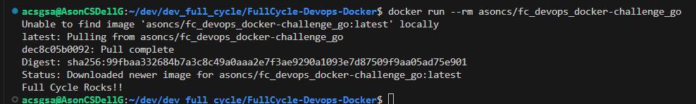
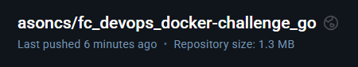

### Full Cycle - Devops - Docker (Full Cycle 3.0 Course)

## Folder [/course](/course)

## Folder [/challenge_go](/challenge_go)

-   <a href="https://hub.docker.com/repository/docker/asoncs/fc_devops_docker-challenge_go"><b>Docker Hub</b> link image</a>
-   Docker command `docker run asoncs/fc_devops_docker-challenge_go`

### Output



### Image size



### main.go

```go
package main

import "fmt"

func main() {
	fmt.Println("Full Cycle Rocks!!")
}
```

### Dockerfile.prod

```Dockerfile
FROM golang:alpine AS builder

WORKDIR /app

COPY . .
RUN rm -f ./main
RUN go build cmd/app/main.go

FROM scratch
COPY --from=builder ./app/main .
CMD [ "./main" ]
```
