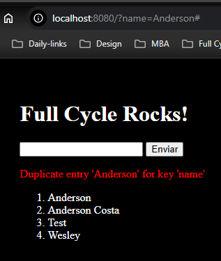

# Full Cycle - Devops - Docker (Full Cycle 3.0 Course)

<div align="center">
    
    
    
    
    
</div>

## Folder [/course](/course)

## Folder [/challenge_go](/challenge_go)

-   <a href="https://hub.docker.com/repository/docker/asoncs/fc_devops_docker-challenge_go"><b>Docker Hub</b> link image</a>
-   Docker command `docker run asoncs/fc_devops_docker-challenge_go`

### Output


### Image size


### main.go

```go
package main

import "fmt"

func main() {
    fmt.Println("Full Cycle Rocks!!")
}
```

### Dockerfile.prod

```Dockerfile
FROM golang:alpine AS builder

WORKDIR /app

COPY . .
RUN rm -f ./main
RUN go build cmd/app/main.go

FROM scratch
COPY --from=builder ./app/main .
CMD [ "./main" ]
```

## Folder [/challenge_nginx_node](/challenge_nginx_node)

### Web localhost:8080



### docker-compose.yaml

```yaml
services:
    app:
        build:
            context: node
        container_name: app
        networks:
            - nginx_node
        volumes:
            - ./node:/usr/src/app
        tty: true
        depends_on:
            db:
                condition: service_started
        ports:
            - '3000:3000'

    db:
        image: mysql:5.7
        container_name: db
        command: --innodb-use-native-aio=0
        restart: always
        tty: true
        volumes:
            - ./mysql:/var/lib/mysql
        environment:
            - MYSQL_DATABASE=nodedb
            - MYSQL_ROOT_PASSWORD=root
        networks:
            - nginx_node

    nginx:
        build:
            context: nginx
        container_name: nginx
        depends_on:
            app:
                condition: service_started
        networks:
            - nginx_node
        ports:
            - '8080:80'

networks:
    nginx_node:
        driver: bridge
```

### nginx.conf

```conf
server {
    listen "80";

    add_header "X-Frame-Options" "SAMEORIGIN";
    add_header "X-XSS-Protection" "1; mode=block";
    add_header "X-Content-Type-Options" "nosniff";

    charset "utf-8";

    location / {
        proxy_pass "http://app:3000";
    }
}
```

### Node files

1. [service.js](challenge_nginx_node/node/service.js)
    - Database's code
2. [index.js](challenge_nginx_node/node/index.js)
    - Application script
